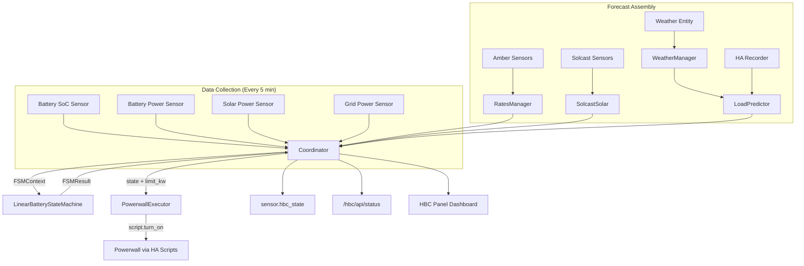

# Architecture

A contributor guide to House Battery Control's codebase.

---

## Module Map

| File | Purpose |
|---|---|
| `__init__.py` | Integration entry point: panel registration, coordinator setup, platform forwarding |
| `config_flow.py` | 3-step config wizard + options flow for runtime reconfiguration |
| `const.py` | All `CONF_*` constants, `DEFAULT_*` values, FSM state names |
| `coordinator.py` | `DataUpdateCoordinator`: orchestrates 5-min update cycle, assembles `FSMContext`, builds diagnostic plan table |
| `execute.py` | `PowerwallExecutor`: FSM state → HA script calls with deduplication |
| `sensor.py` | Exposes `sensor.hbc_state` and `sensor.hbc_projected_cost` to HA |
| `web.py` | HTTP views: dashboard panel, `/hbc/api/status`, `/hbc/api/ping`, `/hbc/api/config-yaml`, `/hbc/api/load-history` |
| `rates.py` | `RatesManager`: fetches + merges Amber Electric import/export tariffs |
| `load.py` | `LoadPredictor`: builds 24h load forecast from 5-day recorder history + temperature adjustment |
| `weather.py` | `WeatherManager`: extracts hourly temperature forecasts from HA weather entities |
| `historical_analyzer.py` | Statistical profiling of load history into 5-minute averages |
| `fsm/base.py` | ABC: `FSMContext`, `FSMResult`, `BatteryStateMachine` interface |
| `fsm/lin_fsm.py` | `LinearBatteryStateMachine`: LP solver (SciPy HiGHS) — the core optimiser |
| `fsm/dp_fsm.py` | `DPBatteryStateMachine`: Dynamic Programming solver (alternative, CPU-intensive) |
| `fsm/default.py` | Simple rule-based FSM fallback |
| `solar/base.py` | ABC for solar forecast providers |
| `solar/solcast.py` | `SolcastSolar`: Solcast HA integration adapter |
| `frontend/hbc-panel.js` | LitElement web component for the sidebar panel dashboard |

---

## Data Flow



---

## Key Interfaces

### FSMContext → Solver

```python
FSMContext(
    soc=85.0,                    # Current battery %
    solar_production=2.5,        # Current PV (kW)
    load_power=1.2,              # Current load (kW)
    grid_voltage=240.0,          # Grid voltage (V)
    current_price=28.5,          # Current price (c/kWh)
    forecast_solar=[...],        # 288 × {start, kw}
    forecast_load=[...],         # 288 × {start, kw}
    forecast_price=[...],        # 288 × RateInterval
    config={...},                # Battery specs + config keys
    acquisition_cost=12.0,       # Stored energy cost (c/kWh)
)
```

### Solver → FSMResult

```python
FSMResult(
    state="DISCHARGE_GRID",      # What to do now
    limit_kw=5.0,                # At what power level
    reason="Export profitable: sell@45c > buy@28c",
    target_soc=20.0,             # Where SoC should end up
    projected_cost=-2.50,        # 24h projected cost ($, negative = profit)
    future_plan=[...],           # 288-interval optimal schedule
)
```

---

## Testing

### Test Suite Structure

| Test File | Coverage |
|---|---|
| `test_init.py` | Integration loading, constants, web view imports |
| `test_config_flow.py` | Config keys, flow steps, options schema |
| `test_coordinator.py` | Update cycle, sensor reading, error recovery |
| `test_fsm_base.py` | FSMContext/FSMResult contracts |
| `test_fsm.py` | LP solver state transitions |
| `test_dp.py` | DP solver (alternative engine) |
| `test_execute.py` | Executor deduplication and script mapping |
| `test_load.py` | Load prediction from history |
| `test_weather.py` | Weather forecast extraction |
| `test_web.py` | API responses, plan table, power flow SVG |
| `test_sensor.py` | Sensor entity registration |
| `test_rates.py` | Rate parsing + merging |

### Running Tests

```bash
pip install -r requirements_test.txt
python -m pytest tests/ -v          # Full suite (133 tests)
python -m pytest tests/ -v -k fsm   # FSM tests only
ruff check custom_components/ tests/ # Linting
```

### Conftest Patterns

- `conftest.py` provides a `mock_hass` fixture with pre-configured entity states
- Tests use `unittest.mock.patch` to isolate HA internals
- No real HA instance required — all tests run offline

---

## Code Style

- **Type hints**: All public functions are type-annotated; `mypy` is used for static analysis
- **Linting**: `ruff` with default rules
- **Formatting**: Standard Python conventions (no black/yapf enforced)
- **Naming**: `CONF_*` for config keys, `DEFAULT_*` for defaults, `STATE_*` for FSM states
