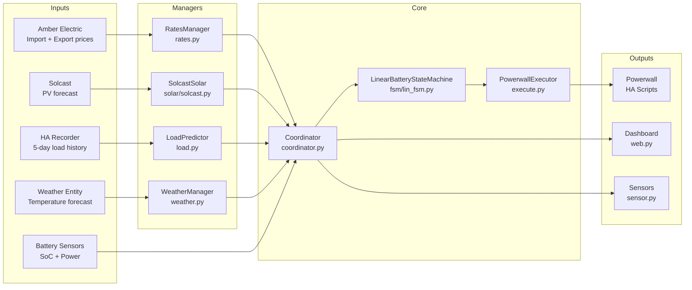

# How It Works

This document explains the full data pipeline of House Battery Control — from raw sensor data to Powerwall commands. It covers every input, every output, and what each component does with the data.

The solver's mathematical formulation (linear programming) is intentionally omitted. Instead, this document explains *what the solver tries to achieve* and *what rules it follows*.

---

## The 5-Minute Cycle

HBC operates on a 5-minute cadence, aligned with Amber Electric's pricing intervals:

```
Every 5 minutes:
  1. Collect  → Read all sensor values + forecasts
  2. Predict  → Build 24-hour load forecast from history
  3. Solve    → Calculate optimal battery schedule
  4. Execute  → Send command to Powerwall (if state changed)
  5. Report   → Update dashboard + sensors + API
```

The coordinator also listens for state changes on vital telemetry entities and can trigger an immediate re-evaluation outside the 5-minute cycle.

---

## Data Pipeline



---

## Inputs (Detailed)

### 1. Tariff Rates

**Source**: Amber Electric integration sensors  
**Manager**: `RatesManager` (`rates.py`)  
**Sample rate**: 5-minute intervals (chunked from Amber's 30-min or variable intervals)  
**Horizon**: 24 hours (~288 intervals)

The `RatesManager` reads from two HA sensor entities:
- **Import price sensor** — `forecast` attribute containing future buy prices
- **Export price sensor** — `forecast` attribute containing future sell/feed-in prices

Additionally, the `Coordinator` itself explicitly overrides the immediate `t=0` calculations if **Current Import Price Entity** or **Current Export Price Entity** are configured. This guarantees the FSM responds to instantaneous price spikes (like Amber's 5-minute pre-dispatch) without waiting for the 30-minute forecast array to align.

Each interval is parsed into a `RateInterval`:

```
RateInterval {
    start:        datetime     # Interval start (UTC, timezone-aware)
    end:          datetime     # Interval end (UTC, timezone-aware)
    import_price: float        # Buy price in c/kWh
    export_price: float        # Sell price in c/kWh
    type:         str          # "ACTUAL" or "FORECAST"
}
```

Amber publishes prices in 30-minute blocks. RatesManager **chunks these into 5-minute ticks** so every rate interval matches the solver's resolution. Import and export rates are **merged by start time** into a single timeline.

### 2. Solar Forecast

**Source**: Solcast HACS integration  
**Manager**: `SolcastSolar` (`solar/solcast.py`)  
**Sample rate**: Variable (typically 30-minute), interpolated to 5-minute  
**Horizon**: 24–48 hours

The Solcast sensors provide `forecast` attributes with predicted PV generation. Each interval:

```
Solar Interval {
    start: str (ISO 8601)    # Interval start
    kw:    float             # Predicted solar production in kW
}
```

### 3. Load Forecast

**Source**: HA Recorder (5-day history of configured load/energy sensor)  
**Manager**: `LoadPredictor` (`load.py`)  
**Sample rate**: 5-minute intervals  
**Horizon**: 24 hours (288 intervals)

LoadPredictor builds a statistical profile from your actual usage history:

1. Fetches 5 days of history from the HA recorder for the configured load entity
2. Passes through `historical_analyzer.py` to build an average profile per 5-minute time slot
3. Handles both **power sensors** (kW, used directly) and **energy sensors** (kWh, converted via `kW = delta_kWh × 12`)
4. Applies **temperature adjustments**: if the weather forecast shows temperatures above/below your configured thresholds, the load prediction is increased by `sensitivity × degrees_beyond_threshold`

Each interval:

```
Load Interval {
    start: str (ISO 8601)    # Interval start
    kw:    float             # Predicted household load in kW (dynamically scaled)
}
```

### 4. Weather Forecast

**Source**: Any HA weather entity  
**Manager**: `WeatherManager` (`weather.py`)  
**Sample rate**: Hourly  
**Horizon**: 24+ hours

Provides temperature data used by the LoadPredictor for temperature-adjusted load forecasts:

```
Weather Interval {
    datetime:    datetime    # Forecast time
    temperature: float      # Predicted temperature in °C
    condition:   str        # "sunny", "cloudy", "rainy", etc.
}
```

### 5. Battery State (Real-Time)

**Source**: Battery sensors configured in Step 1  
**Read by**: Coordinator directly via `_get_sensor_value()`

| Field | Source Entity | Unit | Notes |
|---|---|---|---|
| `soc` | `battery_soc_entity` | % | Current charge level (0–100) |
| `battery_power` | `battery_power_entity` | kW | Positive = discharging (or inverted) |
| `solar_production` | `solar_entity` | kW | Current PV output |
| `grid_power` | `grid_entity` | kW | Positive = importing (or inverted) |
| `current_price` | `import_price_entity` | c/kWh | Current import (buy) spot price |
| `current_export_price` | `export_price_entity` | c/kWh | Current export (sell) spot price |

### 6. Battery Configuration

**Source**: Config flow settings (Step 2)

| Field | Key | Unit | Default |
|---|---|---|---|
| Capacity | `battery_capacity` | kWh | 27.0 |
| Max charge/discharge rate | `battery_rate_max` | kW | 6.3 |
| Inverter limit | `inverter_limit` | kW | 10.0 |
| Reserve SoC floor | `reserve_soc` | % | 0.0 |
| No-Import Periods | `no_import_periods` | String | "" |

These are used to construct a `FakeBattery` model that the solver uses to simulate battery behaviour over the 24-hour horizon.

---

## The FSM Context (Solver Input)

All inputs are assembled by the Coordinator into an `FSMContext` dataclass — the single input to the solver:

```python
@dataclass
class FSMContext:
    soc: float              # Current battery % (0–100)
    solar_production: float # Current PV output (kW)
    load_power: float       # Current house load (kW)
    grid_voltage: float     # Grid voltage (V) — optional
    current_price: float    # Current import price (c/kWh)
    forecast_solar: list    # 288 × {start, kw}
    forecast_load: list     # 288 × {start, kw}
    forecast_price: list    # 288 × RateInterval
    config: dict            # Battery specs + all config keys
    acquisition_cost: float # Weighted average cost of stored energy (c/kWh)
```

---

## Financial Tracking & Persistence

HBC tracks the financial performance of your battery using two key metrics that persist across Home Assistant restarts:

1. **Cumulative Cost ($)**: The running total of money spent (or earned, if negative) since the integration was first installed. This is calculated internally by analyzing the actual grid interactions (import/export) during each 5-minute interval.
2. **Acquisition Cost (c/kWh)**: The blended average cost of the energy currently sitting in your battery. 

### Dynamic Acquisition Cost Calculation
The system calculates the true cost of stored energy rather than just using a static figure. Every 5 minutes, if the battery is actively charging, HBC calculates the cost of the raw energy entering the battery:
- **Grid Charging**: Valued at the current Amber import price.
- **Solar Charging**: Valued at the *opportunity cost* (what you could have earned if you exported that solar to the Amber grid instead).

This incoming energy cost is then mathematically blended (weighted average) against the existing energy in the battery to update the `acquisition_cost`. This dynamic acquisition cost is fed into the FSM solver as a floor price, preventing the battery from exporting energy for less than it cost to acquire.

### Persistence Mechanism
Both `cumulative_cost` and `acquisition_cost` are securely written to Home Assistant's internal `Store` API (`.storage/house_battery_control.cost_data`). The integration utilizes delayed JSON writes to buffer I/O operations, ensuring data survives system reboots and updates without degrading Home Assistant's performance.

---

## What the Solver Does

The solver (`LinearBatteryController` in `fsm/lin_fsm.py`) takes the `FSMContext` and calculates the mathematically optimal battery schedule. Here's what it tries to achieve and what rules it follows:

### Objective

**Minimise total daily electricity cost.**

This means: minimise the total amount you pay for imported grid power, minus the revenue from exported power, across all 288 five-minute intervals in the next 24 hours.

### Decision Variables

For each 5-minute interval, the solver chooses:

| Variable | What it controls | Bounds |
|---|---|---|
| Grid import | How much to buy from the grid | ≥ 0 kW |
| Grid export | How much to sell to the grid | ≥ 0 kW |
| Battery charge | How much to charge the battery | ≥ 0 kW, ≤ charge rate limit |
| Battery discharge | How much to discharge the battery | ≥ 0 kW, ≤ discharge rate limit |

### Constraints (Rules the Solver Must Follow)

1. **Energy balance**: At every interval, energy in = energy out. Grid import + solar + battery discharge = house load + grid export + battery charge.
2. **SoC bounds**: Battery state of charge must stay between `reserve_soc` and 100% at all times.
3. **Rate limits**: Charge and discharge power cannot exceed `battery_rate_max`.
4. **Capacity**: Total stored energy cannot exceed `battery_capacity`.
5. **Efficiency losses**: Charging and discharging have 95% round-trip efficiency baked in.
6. **Reserve floor**: SoC must not drop below the configured `reserve_soc` at any interval.
7. **No-Import Periods**: Grid import is bounded to strictly `0.0 kW` during user-defined textual time spans (e.g. `15:00-21:00`), bypassing arbitrage logic.

### What the Solver Does NOT Do

- **It does not predict prices** — it consumes Amber's published forward prices
- **It does not learn from past behaviour** — each solve is independent
- **It does not control individual battery cells** — it sets high-level modes
- **It does not account for grid outages** — it assumes continuous grid availability

---

### Price Forecast Reliability

Amber Electric's forward prices are *forecasts* — they can change significantly between prediction time and the actual dispatch interval. A naive solver that blindly trusts a predicted afternoon price spike may hoard energy for a surge that never eventuates, missing earlier opportunities.

HBC addresses this through several mechanisms:

#### Current Defences

1. **Re-solve on every entity change**  
   The coordinator listens for state changes on price and other telemetry entities. When Amber revises a forecast, the solver re-runs immediately with the updated prices rather than waiting for the next 5-minute cycle. This means the plan automatically adapts as forecasts firm up closer to real-time.

2. **Acquisition cost floor**  
   The solver will **not** export energy to the grid if the feed-in price is below the battery's acquisition cost. This prevents the grid-drain scenario where a predicted high feed-in price (e.g. 25c/kWh) collapses at settlement to negative values (e.g. −2c/kWh). The battery values its stored energy at what it cost to charge — if selling isn't profitable, it holds.

3. **Terminal valuation**  
   Energy remaining in the battery at the end of the 24-hour window is valued at a blended rate between the median buy price and the acquisition cost. This discourages the solver from planning to "run the battery to zero" on speculative future prices.

#### Planned Improvements

The quality of input data — not the solver itself — is the primary challenge. The following approaches are under active consideration:

- **Historical price blending**: Median the last 5 days of actual settled prices as a forecast, blended with Amber's live forecast. This would dampen false spikes while still responding to genuine price events.
- **Spike dampening**: Discount or overwrite predicted spikes (e.g. > $1/kWh) with the average of surrounding non-spike prices, since extreme forecasts are disproportionately unreliable.
- **Forecast confidence weighting**: Place more weight on the Amber forecast when a spike is predicted (since genuine events *do* occur), but temper it with historical data to reduce exposure to false signals.
- **AEMO data source**: Use AEMO's own dispatch data as an alternative or supplementary price signal, which tends to be more conservative than Amber's retail forecasts.

> **Note**: These are the same challenges faced by other home battery optimisers (e.g. Predbat). The input data quality problem is solver-agnostic — any linear or dynamic programming solver consuming the same unreliable forecast will exhibit the same false-spike chasing behaviour.

---

## Outputs (Detailed)

### FSMResult

The solver returns an `FSMResult` — the single output that drives everything:

```python
@dataclass
class FSMResult:
    state: str                              # FSM state name (e.g., "CHARGE_GRID")
    limit_kw: float                         # Power limit for this state (kW)
    reason: str                             # Human-readable explanation
    target_soc: float | None                # Target SoC if applicable (%)
    projected_cost: float | None            # Projected 24h cost ($)
    future_plan: list[dict] | None          # 288-element plan array
```

### FSM States

| State | What It Means | Physical Powerwall Action |
|---|---|---|
| `IDLE` | Solver determined inaction is optimal | Self-Consumption, no forced charge/discharge |
| `CHARGE_GRID` | Cheaper to buy now than buy later | Force charge from grid (Backup mode) |
| `CHARGE_SOLAR` | Absorb available solar production | Self-Consumption, solar only |
| `DISCHARGE_HOME` | Power the house from battery | Self-Consumption, reserve at 0% |
| `DISCHARGE_GRID` | Export to grid for profit | Time-Based Control, export enabled |
| `PRESERVE` | Protect SoC for upcoming high-price period | Backup mode, reserve at 100% |

### Future Plan Array

The `future_plan` is an array of 288 dictionaries, one per 5-minute interval, representing the full optimal schedule:

```
Plan Interval {
    time:         str    # Local time (HH:MM)
    state:        str    # FSM state for this interval
    import_price: float  # c/kWh
    export_price: float  # c/kWh
    solar_kw:     float  # Forecasted solar (kW)
    load_kw:      float  # Forecasted load (kW)
    soc:          float  # Projected SoC at interval end (%)
    cost:         float  # Projected cost for this interval ($)
}
```

---

## Execution

The `PowerwallExecutor` (`execute.py`) translates the FSM state into physical Powerwall commands via HA script calls.

### State → Script Mapping

| FSM State | Script Called | Powerwall Mode |
|---|---|---|
| `CHARGE_GRID` | `script_charge` | Backup mode, grid charging enabled |
| `CHARGE_SOLAR` | `script_charge_stop` | Self-Consumption, solar only |
| `DISCHARGE_HOME` | `script_charge_stop` | Self-Consumption, reserve 0% |
| `DISCHARGE_GRID` | `script_discharge` | Time-Based Control, export enabled |
| `PRESERVE` | `script_discharge_stop` | Backup mode, reserve 100% |
| `IDLE` | `script_charge_stop` + `script_discharge_stop` | Neutral state, stop all overrides |

### Deduplication

The executor tracks the last applied state and power limit. If the solver returns the same state with the same limit as last time, **no command is sent**. This prevents unnecessary API calls and reduces Powerwall wear.

```
if new_state == last_state AND new_limit == last_limit:
    skip (no action)
else:
    apply new state → call configured script
```
